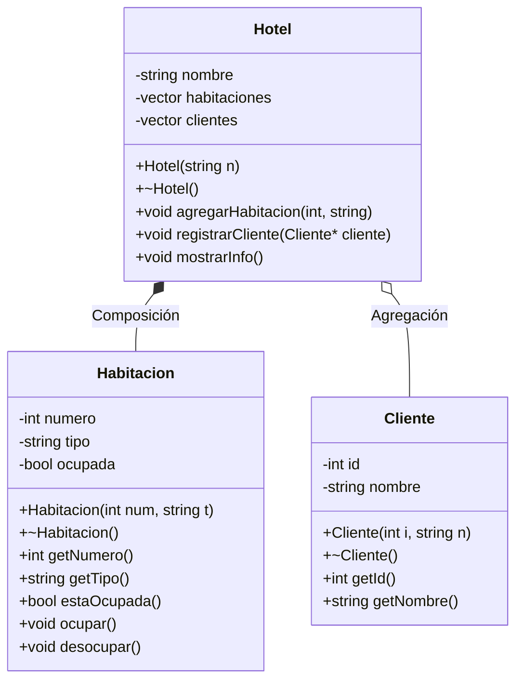

```mermaid
classDiagram

    class Hotel {
        -string nombre
        -vector<Habitacion> habitaciones
        -vector<Cliente*> clientes
        +Hotel(string n)
        +~Hotel()
        +void agregarHabitacion(int, string)
        +void registrarCliente(Cliente* cliente)
        +void mostrarInfo()
    }

    class Habitacion {
        -int numero
        -string tipo
        -bool ocupada
        +Habitacion(int num, string t)
        +~Habitacion()
        +int getNumero() 
        +string getTipo() 
        +bool estaOcupada() 
        +void ocupar()
        +void desocupar()
    }

    class Cliente {
        -int id
        -string nombre
        +Cliente(int i, string n)
        +~Cliente()
        +int getId()
        +string getNombre()
    }

    Hotel *-- Habitacion : Composición
    Hotel o-- Cliente : Agregación
```
