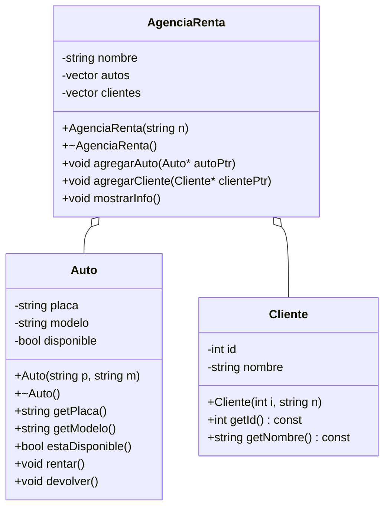

```mermaid
classDiagram

    class AgenciaRenta {
        -string nombre
        -vector<Auto*> autos
        -vector<Cliente*> clientes
        +AgenciaRenta(string n)
        +~AgenciaRenta()
        +void agregarAuto(Auto* autoPtr)
        +void agregarCliente(Cliente* clientePtr)
        +void mostrarInfo()
    }

    class Auto {
        -string placa
        -string modelo
        -bool disponible
        +Auto(string p, string m)
        +~Auto()
        +string getPlaca() 
        +string getModelo()
        +bool estaDisponible() 
        +void rentar()
        +void devolver()
    }

    class Cliente {
        -int id
        -string nombre
        +Cliente(int i, string n)
        +int getId() const
        +string getNombre() const
    }

    AgenciaRenta o-- Auto 
    AgenciaRenta o-- Cliente
```
